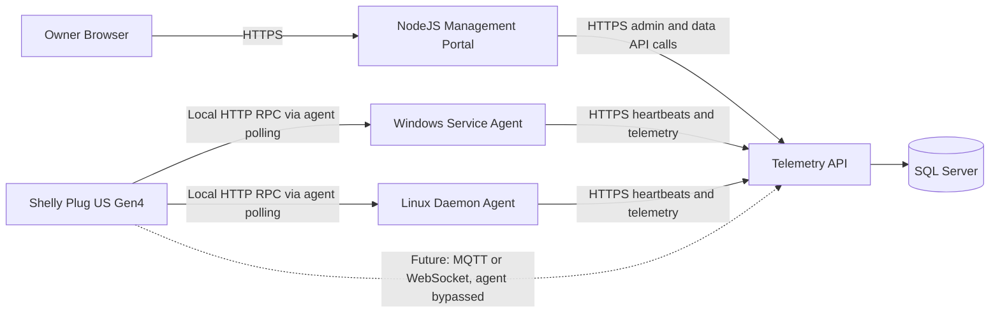

# Architecture Overview

## System Summary

The preferred design is a four-application deployment model backed by shared libraries and a SQL Server database. The ASP.NET Core API remains the single backend for both device reporting and the owner-facing management portal.

The current repository baseline reaches this target through a retained Next.js
starter project named `SystemUptimeTracker.Web`. Unless topology alignment
renames it, that project is the implementation vehicle for the
`SystemUptimeTracker.Portal` role described in this document.

## Deployable Applications

- `SystemUptimeTracker.Api`: ASP.NET Core ingestion API.
- `SystemUptimeTracker.Portal`: NodeJS web frontend and management portal for owner-facing administration and operational data access.
- `SystemUptimeTracker.WindowsService`: Windows background service.
- `SystemUptimeTracker.LinuxDaemon`: Ubuntu systemd-managed daemon.

## Shared Libraries

- `SystemUptimeTracker.Agent.Core`: Shared worker behavior, retry, and publishing logic.
- `SystemUptimeTracker.Contracts`: Shared API contracts and payload models.
- `SystemUptimeTracker.Data`: Entity Framework Core data layer, entities, and migrations.
- `SystemUptimeTracker.Power.Shelly`: Shelly normalization and provider logic.

## Delivery Perspective

Implementation should be reasoned about through two coupled delivery tracks.

### Backend And Platform Track

- Owns the ASP.NET Core API, local Identity integration, SQL Server
  persistence, shared contracts, agent runtime, host applications, and power
  ingestion services.
- Moves first whenever the portal depends on new contracts, schema, or
  authorization rules.
- Publishes stable route, payload, and trace-correlation behavior for the
  portal and agents to consume.

### Frontend And Portal Track

- Owns the NodeJS owner portal built on the retained Next.js shell.
- Implements owner sign-in, secure session handling, typed API-service calls,
  device-account administration, machine and power views, localization, and
  trace-aware user-facing error handling.
- Must consume the shared API surface rather than inventing a second backend
  contract or reading SQL Server directly.

These tracks converge on the versioned `/api/v1` surface and should be
sequenced according to [implementation-plan.md](./implementation-plan.md) and
the execution stories under [stories/2026/07/README.md](./stories/2026/07/README.md).

## Proposed Solution Shape

All implementation code, including automated tests, should live under `src/`.
Test projects should be differentiated by project name rather than by a separate `tests/` folder. The test type should be expressed in the project name, for example `UnitTests`, `IntegrationTests`, or `FunctionalTests`.
Test projects should be created where behavior warrants them. Thin host shells can rely on shared-core tests plus integration or packaging coverage until they contain meaningful platform-specific logic.

```text
src/
  SystemUptimeTracker.Api/
  SystemUptimeTracker.Api.UnitTests/
  SystemUptimeTracker.Api.IntegrationTests/
  SystemUptimeTracker.Api.FunctionalTests/
  SystemUptimeTracker.Portal/
  SystemUptimeTracker.Portal.UnitTests/
  SystemUptimeTracker.Portal.IntegrationTests/
  SystemUptimeTracker.Portal.FunctionalTests/
  SystemUptimeTracker.WindowsService/
  SystemUptimeTracker.LinuxDaemon/
  SystemUptimeTracker.Agent.Core/
  SystemUptimeTracker.Agent.Core.UnitTests/
  SystemUptimeTracker.Agent.Core.IntegrationTests/
  SystemUptimeTracker.Agent.Core.FunctionalTests/
  SystemUptimeTracker.Contracts/
  SystemUptimeTracker.Contracts.UnitTests/
  SystemUptimeTracker.Data/
  SystemUptimeTracker.Data.UnitTests/
  SystemUptimeTracker.Data.IntegrationTests/
  SystemUptimeTracker.Power.Shelly/
  SystemUptimeTracker.Power.Shelly.UnitTests/
```

The proposed solution shape is illustrative rather than exhaustive. Additional test projects or support libraries should be added only when they own distinct behavior or deployment concerns.

## Context Diagram



## Runtime Responsibilities

### Agent Applications

The Windows and Linux applications should be thin hosting shells over shared agent behavior. Their responsibilities are:

- Integrate with Windows Service Control Manager or systemd.
- Collect platform-specific machine telemetry.
- Persist agent identity locally.
- Queue and retry outbound telemetry when the API is unavailable.
- Optionally poll configured Shelly devices.
- Publish telemetry to the API over HTTPS.

### Portal Application

The NodeJS management portal should:

- Authenticate owner users against the same ASP.NET Core API used by reporting devices.
- Provide owner-facing workflows for device-account management, machine and power-meter administration, and location/device association management.
- Provide a human-friendly interface for interacting with collected machine and power data.
- Rely on the API for all business logic and persistence rather than connecting directly to SQL Server.
- Avoid introducing a second backend contract surface; it should consume the same versioned `/api/v1` API as other clients.
- Hold long-lived owner authentication state on the server side or inside
  secure `HttpOnly` cookies rather than exposing it to browser storage.
- Preserve backend trace IDs and generic error semantics when surfacing API
  failures to end users.

### API Application

The API should:

- Issue and validate JWT bearer tokens for reporting agents, owner users, and other telemetry producers, backed by ASP.NET Core Identity local accounts (see [Authentication And Authorization](#authentication-and-authorization)).
- Accept machine heartbeats and optional power readings.
- Accept independent power-meter registration and future direct power ingestion.
- Normalize payloads into the shared data model.
- Calculate or update runtime sessions based on heartbeat continuity.
- Expose health endpoints, owner-facing administrative endpoints, and owner-facing read endpoints needed by the NodeJS management portal.
- Version all routes under `/api/v1` so future contract changes do not silently break deployed agents. See [inital-spec.md](./inital-spec.md) for the endpoint shapes this convention was drawn from; a dedicated API contracts document should formalize the accepted route list before Phase 1 implementation begins.
- Expose contracts stable enough that the portal can generate typed service
  integrations and request or response validators from the same accepted shapes.
- Keep the owner-facing portal workflows and device-facing ingestion workflows
  on one authorization model, while separating them by route purpose and scope.

### Database Layer

SQL Server is the authoritative store for:

- Machine telemetry history.
- Runtime-session history.
- Power-meter registrations and readings.
- Inventory, location, and association state.
- Historical effective-dated relationships.

## Key Architectural Decisions

### Decision 1: Separate Deployables For Windows And Linux

Windows Service and Ubuntu daemon packaging should be separate applications even if most business logic is shared. This avoids conditional deployment behavior leaking into the shared worker.

### Decision 2: Shared Agent Core

Agent behavior should live in one shared library to keep scheduling, retry, publishing, and contract generation consistent across platforms.

### Decision 3: Power Telemetry Is Optional

The machine-monitoring path must work with no Shelly presence. Shelly support is an additive capability.

### Decision 4: Independent Registration Model

Machines and power meters must not depend on each other for creation. Associations are explicit and time-aware.

### Decision 5: Outbound-Only Collection

Agents and power producers send data to the API. The server does not initiate control-plane traffic to monitored devices.

### Decision 6: Shared API For Devices And Portal

The NodeJS management portal and the reporting devices share the same ASP.NET Core API. Device ingestion and owner-facing administration are separated by route grouping and authorization scope, not by separate backend services. The portal must not bypass the API and read or write SQL Server directly.

## Core Data Flows

### Owner Portal Flow

1. Owner opens the NodeJS management portal in a browser.
2. Portal authenticates the owner against the shared ASP.NET Core API.
3. Portal calls owner-authorized API endpoints to manage device accounts, machines, power meters, locations, and associations.
4. Portal calls owner-authorized read endpoints to display collected machine and power telemetry.
5. API enforces authorization and persists any resulting changes in SQL Server.

### Device Account Provisioning And First Connection Flow

1. Owner creates a `DeviceAccount` (dedicated to one machine, or shared across several), choosing JWT, API key, or both as its allowed authentication methods.
2. The resulting initial credential — a password for JWT-capable devices, or an API key for Basic Auth devices — is supplied out-of-band into the Windows Service or systemd daemon's local configuration at install time.
3. On first run, a JWT-capable agent exchanges that initial credential once at the token endpoint for an access token and a refresh token.
4. The agent persists the refresh token (or re-derives access tokens from it) and rotates its access token periodically thereafter, without resending the initial credential on every call. Whether the initial credential remains usable as a standing fallback or is invalidated after first use is an open question (see [product-scope.md](./product-scope.md)).
5. A Basic Auth device instead sends its API key on every call; there is no rotation step unless the owner manually issues a new key.

### Machine Heartbeat Flow

1. Agent starts and loads local identity.
2. Agent collects machine telemetry.
3. Agent posts heartbeat payload to the API, authenticated with its current bearer token or API key.
4. API validates sender and stores machine and heartbeat data.
5. API updates runtime-session state based on prior heartbeats.

### Shelly Via Agent Flow

1. Agent polls a configured Shelly Plug US Gen4 over local HTTP RPC.
2. Agent normalizes the Shelly response into a power-reading contract.
3. Agent posts the power reading with its heartbeat or through a related endpoint (see the open question in [implementation-plan.md](./implementation-plan.md) on which transport wins).
4. API stores the reading against the power meter and validates any machine relationship.

### Future Direct Shelly Flow

1. Shelly device or broker-connected ingestion service sends power telemetry directly.
2. API or ingestion worker resolves meter identity.
3. Reading is normalized into the same storage model used by agent-mediated readings.

## Deployment View

### Windows Agent

- Publish `SystemUptimeTracker.WindowsService.exe` as a self-contained,
  single-file `win-x64` service executable.
- Package `Install-SystemUptimeTrackerWindowsService.ps1` and
  `Uninstall-SystemUptimeTrackerWindowsService.ps1` beside the executable.
- Register the service as `SystemUptimeTrackerAgent`, displayed as
  `System Uptime Tracker Agent`, with automatic startup and restart-on-failure
  recovery.
- Install versioned application releases below
  `C:\Program Files\SystemUptimeTracker\Agent\releases` and persist identity,
  retry state, and diagnostics separately below
  `C:\ProgramData\SystemUptimeTracker\Agent`.
- Default to `NT AUTHORITY\LocalService` unless a telemetry provider has a
  documented need for additional rights. Grant only required filesystem,
  event-log, and outbound-network access.
- Use the hosting, artifact, and installer design in
  [windows-service-reference.md](./windows-service-reference.md) as the concrete
  implementation baseline. Adapt its proven service lifecycle and idempotent
  registration shape while applying the security, rollback, and asynchronous
  execution improvements identified there.

### Ubuntu Agent

- Publish as a Linux-targeted daemon executable.
- Install under a fixed application directory.
- Register under systemd with restart and minimal required filesystem access.

### API

- Support local containerized development.
- Support IIS, Azure App Service, or Linux-hosted Kestrel deployments.
- Use SQL Server in all durable environments.

### Portal

- Run as a NodeJS web application.
- Be deployable independently from the API, while consuming the same API over HTTPS.
- Be hostable behind the same reverse proxy/domain family as the API, or on a separate origin with tightly scoped CORS.
- Never require direct database connectivity.

The Windows deployment identifiers are defined above. The systemd unit name,
Linux install and data directories, and final cross-platform configuration file
contract still need to be defined under the `SystemUptimeTracker` naming
established in this document. Other portions of
[inital-spec.md](./inital-spec.md) still use placeholder
`ComputerTelemetry`/`computer-telemetry` names from before the project was
renamed; do not carry those literal strings into implementation.

## Cross-Cutting Concerns

### Authentication And Authorization

**Decided:** the API authenticates callers using **ASP.NET Core Identity** with **local user accounts** — no external identity provider is in scope for the first release. The top priority driving this design is minimizing the ingestion API's attack surface: every non-health endpoint requires authentication, credentials are never stored in plaintext, and device-facing credentials carry only enough privilege to submit telemetry. This supersedes the `Authorization: AgentKey ...` header scheme shown in [inital-spec.md](./inital-spec.md).

#### Account Model: Owner And Device Accounts

- **Owner account**: a human user (an ASP.NET Core Identity account in the `Owner` role) who administers the deployment. An owner creates and removes device accounts, and decides whether devices share one account or each get their own.
- **Device account**: modeled by the `DeviceAccount` entity (see [domain-model.md](./domain-model.md)), which wraps an Identity user with the extra metadata authentication needs — which owner manages it, which authentication methods it's allowed to use, and (if enabled) its hashed API key. A `Machine` references the `DeviceAccount` currently authorized to report on its behalf via `Machine.DeviceAccountId`; multiple machines may point at the same device account (shared) or each may have its own (dedicated) — the owner's choice, not a fixed system rule.
- The machine's own `AgentId` — not the account used to authenticate — remains the durable identity written onto every heartbeat and reading. The device account proves the caller is allowed to write; `AgentId` says which machine the data is about.
- Owner users sign into the NodeJS portal using the same API and ASP.NET Core Identity account store, but they use owner-authorized portal/admin/read endpoints rather than telemetry-only ingestion routes.

#### Two Authentication Schemes, One Authorization Scope

Every device account is configured to use one (or both) of two schemes, chosen based on what the device can support. Both land in the same restricted, telemetry-only authorization scope — neither can reach administrative endpoints (association, location, or device-account management), which require an owner account instead.

1. **JWT bearer tokens (primary).** Used by the Windows Service and Linux daemon agents. When a service is first registered, it is supplied its device account's credentials out-of-band (placed into local configuration at install time). On first run, the agent exchanges those credentials once at a token endpoint for a signed JWT access token plus a refresh token, backed by ASP.NET Core Identity. From then on the agent presents the access token as a bearer token on every heartbeat/telemetry call and rotates it via the refresh token on a periodic basis — it does not resend the original credential on every request. ASP.NET Core's built-in Identity API endpoints (`MapIdentityApi<TUser>()`) are the natural fit for issuing these tokens without a separate token-service dependency; the concrete endpoint/claims/lifetime contract is tracked in [implementation-plan.md](./implementation-plan.md).
2. **HTTP Basic Auth with an API key (fallback).** For devices that cannot perform a login/refresh flow — for example, a Shelly Plug US Gen4 driven by a webhook, MQTT bridge, or on-device script — the device account's "password" is a long-lived, hashed, individually revocable **API key**, never a real changing password. The client sends `Authorization: Basic base64(deviceAccountName:apiKey)` over HTTPS. This trades some of the JWT flow's exposure-reduction for compatibility with constrained clients, so it is offered per device account rather than as the default.

For the NodeJS portal, owner authentication should use the API's owner-account login flow only. The portal should not use device-account Basic Auth, and it should avoid exposing long-lived credentials in browser storage. If the NodeJS layer stores API-issued refresh tokens, they should remain server-side or inside secure, `HttpOnly` cookies rather than in local storage.

#### Hardening Baseline

- HTTPS-only for all traffic, without exception — this matters even more once Basic Auth is in play, since it carries the credential (base64-encoded, not encrypted) on every request.
- If the NodeJS portal and API are hosted on different origins, CORS must be restricted to the portal origin and owner-authenticated state-changing requests must be protected from CSRF when cookie-based session patterns are used.
- API keys and Identity password hashes are salted/hashed at rest; a plaintext API key is shown to the owner exactly once, at creation or rotation time, and never again.
- Account lockout after repeated failed authentication attempts (ASP.NET Core Identity's built-in lockout), plus rate limiting on the token and Basic Auth entry points, to blunt credential-stuffing and brute-force attempts against the most exposed part of the system.
- API keys are individually revocable and rotatable by the owning owner account without needing to touch the underlying Identity user.
- Role/scope-based authorization is enforced the same way regardless of which of the two schemes authenticated the caller: device-scoped principals only ever reach ingestion endpoints.

### Security

- No trusted client-supplied server timestamps.
- Idempotent handling for retried messages.
- Never store power-meter credentials (for example, a Shelly device password) directly on the `PowerMeter` record. Store a reference to a secret manager or encrypted secret store instead — see `AuthenticationReference` in [domain-model.md](./domain-model.md). This is a distinct concern from API authentication above: it is the credential the *agent* uses to poll the Shelly plug locally, not a credential for calling this API.

### Reliability

- Local retry queue for agents. [inital-spec.md](./inital-spec.md) recommends a SQLite-backed queue with a maximum age of 7 days, a maximum size of 100 MB, and a retry backoff progression of 15s, 30s, 1m, 5m, 15m; these defaults have not yet been formally accepted (see the open question in [implementation-plan.md](./implementation-plan.md)).
- Gap-based runtime-session logic for missed heartbeats, using a default heartbeat interval of 60 seconds, an offline threshold of 3 minutes, and a session-break threshold of 5 minutes as illustrative starting points from the original design conversation. These thresholds should be confirmed and made configurable per machine before Phase 1 exit.
- Health endpoints for API and database dependencies.

### Observability

- Structured logging in agents and API.
- Consistent correlation identifiers for heartbeats and power readings.
- Operational metrics for ingestion success, retry backlog, and registration failures.

### Extensibility

- Power telemetry providers should be pluggable.
- Direct-ingestion power paths should normalize into the same domain entities.
- Additional device types and locations should fit the same association model without schema redesign.
