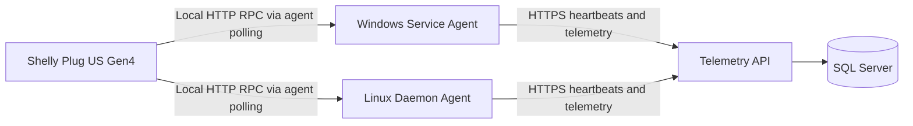

# Architecture Overview

## System Summary

The preferred design is a three-application deployment model backed by shared libraries and a SQL Server database.

## Deployable Applications

- `SystemUptimeTracker.Api`: ASP.NET Core ingestion API.
- `SystemUptimeTracker.WindowsService`: Windows background service.
- `SystemUptimeTracker.LinuxDaemon`: Ubuntu systemd-managed daemon.

## Shared Libraries

- `SystemUptimeTracker.Agent.Core`: Shared worker behavior, retry, and publishing logic.
- `SystemUptimeTracker.Contracts`: Shared API contracts and payload models.
- `SystemUptimeTracker.Data`: Entity Framework Core data layer, entities, and migrations.
- `SystemUptimeTracker.Power.Shelly`: Shelly normalization and provider logic.

## Proposed Solution Shape

All implementation code, including automated tests, should live under `src/`.
Test projects should be differentiated by project name rather than by a separate `tests/` folder. The test type should be expressed in the project name, for example `UnitTests`, `IntegrationTests`, or `FunctionalTests`.
Test projects should be created where behavior warrants them. Thin host shells can rely on shared-core tests plus integration or packaging coverage until they contain meaningful platform-specific logic.

```text
src/
  SystemUptimeTracker.Api/
  SystemUptimeTracker.Api.UnitTests/
  SystemUptimeTracker.Api.IntegrationTests/
  SystemUptimeTracker.Api.FunctionalTests/
  SystemUptimeTracker.WindowsService/
  SystemUptimeTracker.LinuxDaemon/
  SystemUptimeTracker.Agent.Core/
  SystemUptimeTracker.Agent.Core.UnitTests/
  SystemUptimeTracker.Agent.Core.IntegrationTests/
  SystemUptimeTracker.Agent.Core.FunctionalTests/
  SystemUptimeTracker.Contracts/
  SystemUptimeTracker.Contracts.UnitTests/
  SystemUptimeTracker.Data/
  SystemUptimeTracker.Data.UnitTests/
  SystemUptimeTracker.Data.IntegrationTests/
  SystemUptimeTracker.Power.Shelly/
  SystemUptimeTracker.Power.Shelly.UnitTests/
```

## Context Diagram



## Runtime Responsibilities

The proposed solution shape is illustrative rather than exhaustive. Additional test projects or support libraries should be added only when they own distinct behavior or deployment concerns.

## Agent Applications

The Windows and Linux applications should be thin hosting shells over shared agent behavior. Their responsibilities are:

- Integrate with Windows Service Control Manager or systemd.
- Collect platform-specific machine telemetry.
- Persist agent identity locally.
- Queue and retry outbound telemetry when the API is unavailable.
- Optionally poll configured Shelly devices.
- Publish telemetry to the API over HTTPS.

## API Application

The API should:

- Authenticate reporting agents and other telemetry producers.
- Accept machine heartbeats and optional power readings.
- Accept independent power-meter registration and future direct power ingestion.
- Normalize payloads into the shared data model.
- Calculate or update runtime sessions based on heartbeat continuity.
- Expose health endpoints and administrative endpoints needed for association management.

## Database Layer

SQL Server is the authoritative store for:

- Machine telemetry history.
- Runtime-session history.
- Power-meter registrations and readings.
- Inventory, location, and association state.
- Historical effective-dated relationships.

## Key Architectural Decisions

## Decision 1: Separate Deployables For Windows And Linux

Windows Service and Ubuntu daemon packaging should be separate applications even if most business logic is shared. This avoids conditional deployment behavior leaking into the shared worker.

## Decision 2: Shared Agent Core

Agent behavior should live in one shared library to keep scheduling, retry, publishing, and contract generation consistent across platforms.

## Decision 3: Power Telemetry Is Optional

The machine-monitoring path must work with no Shelly presence. Shelly support is an additive capability.

## Decision 4: Independent Registration Model

Machines and power meters must not depend on each other for creation. Associations are explicit and time-aware.

## Decision 5: Outbound-Only Collection

Agents and power producers send data to the API. The server does not initiate control-plane traffic to monitored devices.

## Core Data Flows

## Machine Heartbeat Flow

1. Agent starts and loads local identity.
2. Agent collects machine telemetry.
3. Agent posts heartbeat payload to the API.
4. API validates sender and stores machine and heartbeat data.
5. API updates runtime-session state based on prior heartbeats.

## Shelly Via Agent Flow

1. Agent polls a configured Shelly Plug US Gen4 over local HTTP RPC.
2. Agent normalizes the Shelly response into a power-reading contract.
3. Agent posts the power reading with its heartbeat or through a related endpoint.
4. API stores the reading against the power meter and validates any machine relationship.

## Future Direct Shelly Flow

1. Shelly device or broker-connected ingestion service sends power telemetry directly.
2. API or ingestion worker resolves meter identity.
3. Reading is normalized into the same storage model used by agent-mediated readings.

## Deployment View

## Windows Agent

- Publish as a Windows-targeted service executable.
- Install through Windows Service registration.
- Persist local state under a service-owned data directory.

## Ubuntu Agent

- Publish as a Linux-targeted daemon executable.
- Install under a fixed application directory.
- Register under systemd with restart and minimal required filesystem access.

## API

- Support local containerized development.
- Support IIS, Azure App Service, or Linux-hosted Kestrel deployments.
- Use SQL Server in all durable environments.

## Cross-Cutting Concerns

## Security

- HTTPS-only communication.
- Per-agent authentication from day one.
- No trusted client-supplied server timestamps.
- Idempotent handling for retried messages.

## Reliability

- Local retry queue for agents.
- Gap-based runtime-session logic for missed heartbeats.
- Health endpoints for API and database dependencies.

## Observability

- Structured logging in agents and API.
- Consistent correlation identifiers for heartbeats and power readings.
- Operational metrics for ingestion success, retry backlog, and registration failures.

## Extensibility

- Power telemetry providers should be pluggable.
- Direct-ingestion power paths should normalize into the same domain entities.
- Additional device types and locations should fit the same association model without schema redesign.
