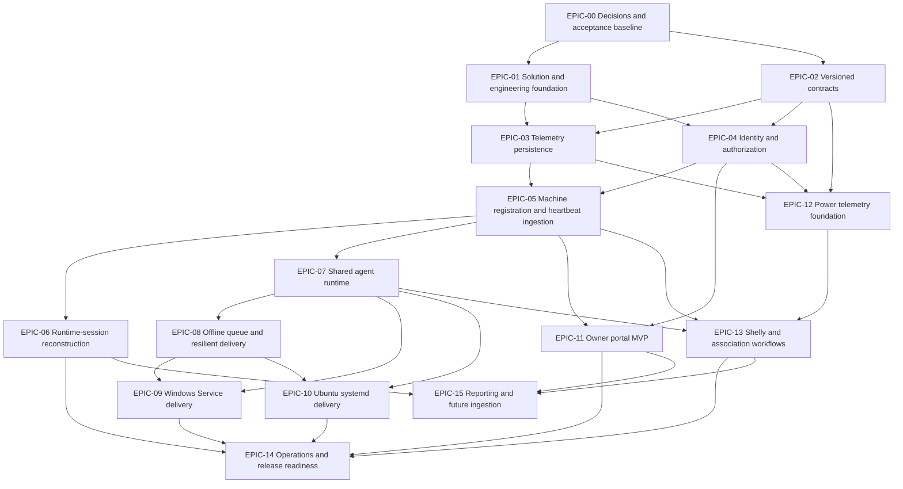

# Delivery Backlog And Dependency Tree

## Purpose

This document is the program-level delivery overview for System Uptime Tracker.
It summarizes the product scope as epics, records the program dependency graph,
and defines release gates and cross-epic completion rules.

The canonical task-level execution files are under
[backlog](./backlog/README.md). Every epic and task has a separate document,
and [the task dependency tree](./backlog/dependency-tree.md) provides the
topological execution waves across the complete backlog.

The higher-level release intent remains in
[implementation-plan.md](./implementation-plan.md). Product boundaries,
architecture, entity semantics, and Windows packaging requirements remain
authoritative in their respective documents. When those documents change,
update the affected task and dependency IDs here in the same pull request.

## Backlog Rules

- Execute a task only after every ID in its `Depends on` field is complete.
- Tasks with the same satisfied predecessors may execute in parallel.
- `None` means that the task has no backlog predecessor; it does not waive
  repository build, security, accessibility, or review requirements.
- A task is complete only when its implementation and listed acceptance
  evidence are both present.
- Existing code is not marked complete merely because a related project or
  class exists. Run the acceptance check and record the result first.
- Keep task IDs stable. Add a new ID instead of renumbering completed work.
- Record status as `Not started`, `In progress`, `Blocked`, or `Done` in the
  corresponding task file. The split backlog intentionally initializes all
  work as `Not started` pending an implementation audit.

## Delivery Baseline

The repository already contains a .NET 10 API, SQL Server-backed ASP.NET Core
Identity foundation, Aspire AppHost, shared and data projects, a Next.js 16
web application, .NET tests, Vitest tests, and QA automation. The agent,
telemetry contract, runtime-session, power-provider, Windows Service, and Linux
daemon project boundaries described by the architecture are not yet present as
distinct projects.

Backlog tasks therefore use two verbs deliberately:

- **Verify and adapt** means inspect an existing capability, preserve working
  behavior, and close the gap against the maintained design.
- **Implement** means add a capability that has no current owning surface.

## Dependency Tree

## Critical Path And Parallel Lanes

The computer-monitoring critical path is:

`EPIC-00 -> EPIC-01/EPIC-02 -> EPIC-03/EPIC-04 -> EPIC-05 -> EPIC-07 -> EPIC-08 -> EPIC-09/EPIC-10 -> EPIC-14`

The following work can proceed in parallel after its predecessors are met:

| Lane | Start condition | Work |
|---|---|---|
| Session lane | Heartbeat persistence is stable | `EPIC-06` |
| Portal lane | Owner authorization and machine APIs are stable | `EPIC-11` |
| Platform lane | Agent core and queue contracts are stable | `EPIC-09`, `EPIC-10` |
| Power lane | Contracts, persistence, and device authorization are stable | `EPIC-12`, then `EPIC-13`; `EPIC-11` supplies the shared device-account and API-key portal workflows |
| Reporting lane | Session, portal, and power read models are stable | `EPIC-15` |

## Epic Summary

Epic edges are completion dependencies: every listed predecessor must be
complete before the dependent epic can be declared complete. Task-file
`depends_on` metadata controls when individual tasks may start and enables the
parallel execution waves in the split backlog.

| Epic | Outcome | Completion depends on | Release gate |
|---|---|---|---|
| EPIC-00 | Decisions and measurable acceptance baseline | None | Gate 0 |
| EPIC-01 | Buildable solution with explicit project ownership | EPIC-00 | Gate 0 |
| EPIC-02 | Accepted and tested `/api/v1` contracts | EPIC-00 | Gate 0 |
| EPIC-03 | Repeatable telemetry schema and persistence | EPIC-01, EPIC-02 | Gate 1 |
| EPIC-04 | Owner and device authentication with least privilege | EPIC-01, EPIC-02 | Gate 1 |
| EPIC-05 | Idempotent machine registration and heartbeat ingestion | EPIC-03, EPIC-04 | Gate 1 |
| EPIC-06 | Deterministic runtime-session history | EPIC-05 | Gate 1 |
| EPIC-07 | Shared cross-platform agent runtime | EPIC-05 | Gate 1 |
| EPIC-08 | Durable offline delivery and recovery | EPIC-07 | Gate 1 |
| EPIC-09 | Installable and upgradable Windows Service | EPIC-07, EPIC-08 | Gate 2 |
| EPIC-10 | Installable Ubuntu systemd daemon | EPIC-07, EPIC-08 | Gate 2 |
| EPIC-11 | Usable owner management portal | EPIC-04, EPIC-05 | Gate 1 |
| EPIC-12 | Independent power-meter data path | EPIC-02, EPIC-03, EPIC-04 | Gate 3 |
| EPIC-13 | Shelly collection and time-aware associations | EPIC-05, EPIC-07, EPIC-12 | Gate 3 |
| EPIC-14 | Deployable, observable, supportable release | EPIC-06, EPIC-09, EPIC-10, EPIC-11, EPIC-13 | Gate 3 |
| EPIC-15 | Aggregate reporting and alternate ingestion readiness | EPIC-06, EPIC-11, EPIC-13 | Gate 4 |

## EPIC-00: Decisions And Acceptance Baseline

**Outcome:** Resolve decisions that affect schema, authorization, contracts,
queue behavior, and deployment before dependent implementation begins.

| Task | Depends on | Implementation detail | Acceptance evidence |
|---|---|---|---|
| TASK-0001 | None | Decide whether first-release registration is pre-provisioned, self-service, or approval-based; document state transitions and who may perform them in `product-scope.md` and `domain-model.md`. | No registration state or transition remains described as an open question. |
| TASK-0002 | None | Decide whether the deployment supports one owner or multiple owners and whether data is isolated by owner; document query and authorization consequences. | Every owner-facing entity and endpoint has an explicit visibility rule. |
| TASK-0003 | None | Select the default device-account policy: shared account or one account per machine, while retaining both supported modes. | Default and owner override behavior are stated in product scope. |
| TASK-0004 | None | Decide whether the bootstrap password is single-use or a standing fallback after the first refresh token is issued. | Credential lifecycle includes issue, first use, rotation, revocation, and recovery. |
| TASK-0005 | None | Accept configurable defaults for heartbeat interval, offline threshold, session-break threshold, clock-skew tolerance, and detailed-telemetry interval. | Values, units, valid ranges, and configuration scope are documented. |
| TASK-0006 | None | Accept the retry store technology, 7-day age cap, 100 MB size cap, retry schedule, overflow policy, and poison-message policy. | Queue decisions are explicit and testable; no queue choice remains open. |
| TASK-0007 | None | Decide whether power readings use a separate endpoint, a combined heartbeat payload, or both; select one canonical storage command. | Contract direction is recorded before `TASK-0206` begins. |
| TASK-0008 | None | Define Gate 1, Gate 2, Gate 3, and Gate 4 release evidence, including required automated suites and target environments. | Each gate in this document has an objective pass/fail checklist. |

**Epic exit:** All decisions are merged into maintained documents, and no
dependent task requires a product or architecture choice during coding.

## EPIC-01: Solution And Engineering Foundation

**Outcome:** Align the existing repository with the actual implementation
boundaries and establish repeatable validation before feature expansion.

| Task | Depends on | Implementation detail | Acceptance evidence |
|---|---|---|---|
| TASK-0101 | TASK-0008 | Inventory the current API, web, data, common, AppHost, test, and QA projects; record which architecture responsibility each existing project owns. | `architecture-overview.md` names the current projects and intended additions without contradictory project trees. |
| TASK-0102 | TASK-0101 | Decide whether `SystemUptimeTracker.Common` becomes the contracts library or whether to add `SystemUptimeTracker.Contracts`; avoid duplicate DTO ownership. | One project owns wire contracts and has no API or EF Core dependency. |
| TASK-0103 | TASK-0101 | Add planned `Agent.Core`, `WindowsService`, `LinuxDaemon`, and `Power.Shelly` projects to the solution only as their first behavior is implemented. | Every added project has a stated responsibility and at least one build or test consumer. |
| TASK-0104 | TASK-0101 | Preserve the existing .NET 10, Next.js 16, React 19, Node 24, NUnit, Vitest, and Playwright toolchain unless a separate upgrade is approved. | Solution and web manifests build with declared versions; no unplanned framework is introduced. |
| TASK-0105 | TASK-0104 | Establish the baseline commands for restore, build, .NET test, web lint/test/build, and QA smoke execution in contributor documentation. | A clean checkout can run every documented command without undocumented manual setup. |
| TASK-0106 | TASK-0105 | Configure CI jobs to run independent .NET, web, contract, migration, and packaging validations with dependency caching. | A failing test or build blocks its owning job; job output identifies the failed slice. |
| TASK-0107 | TASK-0101 | Define configuration precedence and environment naming across API, web, agents, and AppHost; prohibit secrets in committed settings. | Startup validation fails with actionable errors for missing required non-development settings. |
| TASK-0108 | TASK-0105 | Define test ownership: unit for pure rules, integration for SQL/API boundaries, functional for workflows, and packaging tests for installed services. | Each later epic names an existing or planned test project rather than creating an ambiguous test bucket. |

**Epic exit:** The solution structure matches the repository and maintained
architecture, and baseline validation runs locally and in CI.

## EPIC-02: Versioned Contracts

**Outcome:** Freeze interoperable request, response, error, authentication,
idempotency, and pagination contracts before API and agent implementations
diverge.

| Task | Depends on | Implementation detail | Acceptance evidence |
|---|---|---|---|
| TASK-0201 | TASK-0001, TASK-0002, TASK-0003, TASK-0004 | Create `docs/api-contracts.md` with the complete `/api/v1` route catalog, caller type, authorization policy, status codes, and idempotency behavior. | Every initial-release API route appears exactly once with an owning epic. |
| TASK-0202 | TASK-0102 | Define machine registration request/response DTOs, durable `AgentId`, registration status, assigned `MachineId`, and conflict behavior. | Contract serialization tests pin field names, required fields, nullability, and payload version. |
| TASK-0203 | TASK-0005, TASK-0102 | Define heartbeat DTOs for machine metadata, sequence number, sent time, agent start, boot time, CPU, memory, and storage. | Golden JSON tests deserialize valid payloads and reject missing or invalid fields. |
| TASK-0204 | TASK-0004, TASK-0102 | Define owner login, device login, refresh, revoke, and API-key issue/rotate responses without exposing stored secrets. | Examples show token lifetime metadata and one-time plaintext API-key return behavior. |
| TASK-0205 | TASK-0002, TASK-0102 | Define owner read and administration contracts for device accounts, machines, sessions, and telemetry with bounded pagination and filtering. | OpenAPI and contract tests enforce maximum page size and stable sort semantics. |
| TASK-0206 | TASK-0007, TASK-0102 | Define power-meter registration, power reading, location, monitored-device, and effective-dated association contracts. | Dedicated, shared, and collector-only examples are represented without duplicating measured power. |
| TASK-0207 | TASK-0202, TASK-0203, TASK-0206 | Define idempotency keys: `AgentId + SequenceNumber` for heartbeats and meter identity plus `MessageId` for readings. | Duplicate examples specify the same response and no duplicate persistence side effect. |
| TASK-0208 | TASK-0201 | Standardize validation errors on Problem Details, correlation headers, UTC timestamp format, numeric units, and unsupported payload-version responses. | OpenAPI examples and endpoint tests use one error shape and one unit convention. |
| TASK-0209 | TASK-0202, TASK-0203, TASK-0204, TASK-0205, TASK-0206, TASK-0207, TASK-0208 | Generate or maintain the API OpenAPI document, executable HTTP examples, and portal-consumable typed or Zod validators for the accepted v1 surface. | CI detects accidental route, schema, required-field, idempotency, or response-code changes, and verifies the examples and portal validators against the OpenAPI contract. |

**Epic exit:** API, portal, and agents can implement against accepted v1
contracts without sharing runtime implementation assemblies.

## EPIC-03: Telemetry Persistence

**Outcome:** Provide a repeatable SQL Server schema with constraints that
preserve identity, history, idempotency, and time-aware relationships.

| Task | Depends on | Implementation detail | Acceptance evidence |
|---|---|---|---|
| TASK-0301 | TASK-0107, TASK-0202, TASK-0203 | Define the telemetry `DbContext` ownership and migration strategy alongside the existing Identity context; explicitly choose one context or coordinated contexts. | Design-time migration creation and application work without starting the API. |
| TASK-0302 | TASK-0301 | Implement `Machine`, `Heartbeat`, `StorageTelemetry`, and `RuntimeSession` entities with audit fields and domain-model nullability. | EF model tests verify keys, required fields, column types, and relationships. |
| TASK-0303 | TASK-0302 | Add unique indexes for populated `AgentId` and heartbeat idempotency, plus indexes for machine/time and session queries. | Duplicate agent and sequence writes fail at the database boundary; query indexes appear in the migration. |
| TASK-0304 | TASK-0302 | Store server-authoritative `ReceivedAtUtc`; preserve client `SentAtUtc` separately and define precision consistently. | Integration test proves a client cannot set `ReceivedAtUtc`. |
| TASK-0305 | TASK-0302 | Configure storage telemetry as heartbeat-owned history with explicit delete behavior and no accidental cascade from account deletion. | Relationship tests preserve telemetry when a device account is disabled or removed. |
| TASK-0306 | TASK-0303, TASK-0304, TASK-0305 | Create and review the initial telemetry migration and SQL script for least-privilege deployment. | Migration applies to an empty SQL Server database and upgrades a database containing only the existing Identity schema. |
| TASK-0307 | TASK-0306 | Add migration rollback/reapply and model-snapshot drift tests to CI. | CI creates a temporary database, migrates it, and detects an uncommitted model change. |
| TASK-0308 | TASK-0306 | Define retention boundaries for raw heartbeats, storage telemetry, sessions, and later power readings without implementing destructive defaults. | Retention settings are documented and default to preserving data. |

**Epic exit:** A clean or existing Identity database can be migrated
repeatably, and persistence invariants are covered by SQL Server integration
tests.

## EPIC-04: Identity And Authorization

**Outcome:** Adapt the existing Identity implementation into explicit owner and
device security boundaries with JWT as primary authentication and hashed API
keys as the constrained-device fallback.

| Task | Depends on | Implementation detail | Acceptance evidence |
|---|---|---|---|
| TASK-0401 | TASK-0002, TASK-0101, TASK-0204 | Map existing `Admin`, `Manager`, `Contributor`, and `Read` roles to the decided `Owner` and telemetry-only device policies; remove ambiguous privilege overlap. | Authorization tests prove owner and device principals cannot substitute for each other. |
| TASK-0402 | TASK-0301, TASK-0401 | Implement `DeviceAccount` as a domain companion to `ApplicationUser`, including owner, allowed methods, API-key metadata, active state, and audit fields. | Migration and model tests enforce one owner and one Identity user per device account. |
| TASK-0403 | TASK-0402 | Implement owner-authorized create, list, update, disable, delete/reassign, and credential-rotation services with ownership checks. | Cross-owner access follows `TASK-0002`; disabling an account preserves machine and telemetry history. |
| TASK-0404 | TASK-0204, TASK-0402 | Implement device credential exchange and refresh-token rotation with configured access/refresh lifetimes and revocation. | Integration tests cover valid login, expired access, refresh rotation, replay rejection, logout, and disabled account. |
| TASK-0405 | TASK-0204, TASK-0402 | Implement cryptographically random API-key issuance, salted hashing, constant-time verification, one-time display, rotation, and revocation. | Plaintext keys never appear in database rows or logs; old keys fail after rotation. |
| TASK-0406 | TASK-0404, TASK-0405 | Build device claims from server-side account and machine authorization data; never trust client-supplied role, owner, or machine claims. | Tampered claims and cross-machine submissions receive `403` without data mutation. |
| TASK-0407 | TASK-0404, TASK-0405 | Apply lockout and partitioned rate limits to password, token, refresh, and Basic Auth entry points without blocking health probes. | Automated tests prove threshold behavior and recovery after the configured window. |
| TASK-0408 | TASK-0401, TASK-0406 | Require authentication on every non-health route and explicit owner/device policies by route group. | A route inventory test fails when an endpoint lacks expected authorization metadata. |
| TASK-0409 | TASK-0403, TASK-0408 | Audit logs for account creation, disablement, key issue/rotation/revocation, failed authentication, and denied authorization using identifiers rather than secrets. | Log-capture tests verify event presence and secret redaction. |
| TASK-0410 | TASK-0301, TASK-0401 | Implement a one-time first-owner bootstrap path using deployment-supplied secret material, explicit startup validation, and automatic closure after an owner exists. | Integration tests prove bootstrap is unavailable after first-owner creation, rejects missing or weak configuration, and never persists or logs bootstrap secrets. |

**Epic exit:** Owner and device callers authenticate through supported schemes,
receive only required permissions, and cannot cross account or machine
boundaries.

## EPIC-05: Machine Registration And Heartbeat Ingestion

**Outcome:** Register machines independently and ingest validated, idempotent
heartbeats through an authenticated end-to-end path.

| Task | Depends on | Implementation detail | Acceptance evidence |
|---|---|---|---|
| TASK-0501 | TASK-0202, TASK-0306, TASK-0406 | Implement the selected machine registration workflow, including pre-created records, durable `AgentId`, status transitions, and device-account assignment. | Registration integration tests cover first registration, retry, conflict, disabled account, and unauthorized account. |
| TASK-0502 | TASK-0203, TASK-0306, TASK-0408 | Implement `POST /api/v1/heartbeats` with payload-size limits, version validation, authenticated machine scope, and server receipt time. | Contract tests cover `202/200`, `400`, `401`, `403`, `409`, `413`, `422`, and unsupported version behavior as specified. |
| TASK-0503 | TASK-0207, TASK-0502 | Make heartbeat processing atomic and idempotent under sequential and concurrent duplicate delivery. | Parallel duplicate requests produce one heartbeat and one storage-telemetry set. |
| TASK-0504 | TASK-0502 | Normalize OS, architecture, machine name, agent version, CPU, memory, and storage values without silently coercing invalid data. | Boundary tests cover zero, maximum, missing, NaN-equivalent, and out-of-range values. |
| TASK-0505 | TASK-0502 | Update machine `FirstSeenAtUtc`, `LastSeenAtUtc`, metadata, and registration state using server-authoritative rules. | Out-of-order queued heartbeats cannot move `LastSeenAtUtc` backward or overwrite newer metadata incorrectly. |
| TASK-0506 | TASK-0502 | Attach or generate a correlation identifier and emit structured ingestion logs, success/failure metrics, and health diagnostics without machine secrets or raw credentials. | Integration tests correlate request logs with the persisted heartbeat identifier and prove degraded ingestion is visible through health or diagnostic signals. |
| TASK-0507 | TASK-0503, TASK-0504, TASK-0505 | Add SQL Server integration tests for registration through heartbeat persistence, including retry and out-of-order delivery. | Tests run against an isolated migrated SQL Server database and leave no shared state. |
| TASK-0508 | TASK-0507 | Add an end-to-end smoke client that registers a machine, obtains authorization, posts a heartbeat, and reads it as an owner. | QA automation completes the flow using public HTTP contracts only. |

**Epic exit:** A permitted machine can register and submit telemetry repeatedly
without duplication, privilege escalation, or loss of original event time.

## EPIC-06: Runtime-Session Reconstruction

**Outcome:** Derive deterministic uptime sessions from persisted heartbeat
continuity and lifecycle evidence.

| Task | Depends on | Implementation detail | Acceptance evidence |
|---|---|---|---|
| TASK-0601 | TASK-0005, TASK-0503 | Specify the session state machine for first heartbeat, continuation, timeout, reboot, agent restart, suspend/resume, graceful stop, and out-of-order receipt. | A decision table maps every input condition to session mutation and `EndReason`. |
| TASK-0602 | TASK-0601 | Implement the pure session-transition calculator using UTC instants and injected thresholds. | Unit tests cover every decision-table row without database or clock dependencies. |
| TASK-0603 | TASK-0602, TASK-0503 | Integrate session updates in the heartbeat transaction or an idempotent post-ingestion processor with explicit concurrency control. | Concurrent heartbeats cannot create overlapping running sessions for one machine. |
| TASK-0604 | TASK-0603 | Implement timeout closure using a scheduled, restart-safe process and an injectable server clock. | A stopped worker resumes safely and closes each expired session once. |
| TASK-0605 | TASK-0603 | Handle delayed queue uploads by preserving event order and avoiding false uptime across gaps. | A seven-day delayed batch reconstructs the same sessions as chronological ingestion. |
| TASK-0606 | TASK-0603 | Calculate `HeartbeatCount`, `LastHeartbeatAtUtc`, `EndedAtUtc`, and uptime duration with documented boundary semantics. | Tests pin inclusive/exclusive threshold behavior and duration rounding. |
| TASK-0607 | TASK-0604, TASK-0605, TASK-0606 | Add SQL Server integration tests for reboot, restart, timeout, duplicate, concurrent, delayed, and clock-skew scenarios. | Tests prove no overlapping active sessions and stable recomputation results. |
| TASK-0608 | TASK-0607 | Expose owner-authorized current and historical session queries with pagination and deterministic ordering. | API tests return running/offline state and historical sessions for only visible machines. |

**Epic exit:** The same heartbeat history always yields the same non-overlapping
runtime sessions, including retries and delayed delivery.

## EPIC-07: Shared Agent Runtime

**Outcome:** Implement one testable agent core used by thin Windows and Linux
hosts for identity, scheduling, collection, authentication, and publishing.

| Task | Depends on | Implementation detail | Acceptance evidence |
|---|---|---|---|
| TASK-0701 | TASK-0103, TASK-0202, TASK-0203 | Create `SystemUptimeTracker.Agent.Core` and its unit-test project with no Windows Service or systemd hosting dependency. | Project builds on Windows and Linux and exposes host-neutral interfaces. |
| TASK-0702 | TASK-0701 | Define the durable local identity-state boundary and implement atomic first-run `AgentId` creation and load with corrupt-file handling and an OS-supplied durable-state path. | Parallel starts converge on one ID; restart preserves it; corruption produces an actionable failure; secret-bearing state is delegated to protected storage. |
| TASK-0703 | TASK-0701 | Define platform telemetry provider interfaces and normalized snapshots for OS, architecture, boot identity/time, CPU, memory, and storage. | Contract mapping tests produce valid `TASK-0203` payloads. |
| TASK-0704 | TASK-0703 | Implement Windows telemetry collection using least-privilege supported APIs and cancellation-aware asynchronous I/O. | Tests or controlled probes cover unavailable counters and inaccessible volumes without terminating the worker. |
| TASK-0705 | TASK-0703 | Implement Ubuntu telemetry collection from stable OS interfaces with bounded reads and explicit parsing failures. | Tests use fixture data for supported Ubuntu formats and reject malformed values. |
| TASK-0706 | TASK-0702, TASK-0404 | Implement bootstrap login, durable protected token and refresh-metadata storage, proactive access-token refresh, and disabled/revoked response handling. | Fake-server tests cover first login, refresh, expiry, revocation, corrupt protected state, and restart without plaintext persistence or secret logging. |
| TASK-0707 | TASK-0702, TASK-0703, TASK-0706 | Implement the cancellation-aware worker loop with configurable interval, monotonic sequence numbers, and non-overlapping collection cycles. | Virtual-time tests prove interval behavior, cancellation, overrun handling, and sequence persistence. |
| TASK-0708 | TASK-0502, TASK-0707 | Implement the typed HTTPS publishing client with bounded timeouts, contract version header, correlation ID, and response classification. | Fake-server tests distinguish retryable, terminal, reauthentication, and configuration failures. |
| TASK-0709 | TASK-0707, TASK-0708 | Add lifecycle signals for agent start and graceful stop while leaving runtime sessions server-authoritative. | API integration test records lifecycle context without accepting a client-authored session. |

**Epic exit:** One shared worker can collect and publish valid heartbeats on both
target operating systems under deterministic tests.

## EPIC-08: Offline Queue And Resilient Delivery

**Outcome:** Preserve telemetry through transient API outages without unbounded
disk use, duplicate records, or blocked service shutdown.

| Task | Depends on | Implementation detail | Acceptance evidence |
|---|---|---|---|
| TASK-0801 | TASK-0006, TASK-0701 | Define a durable queue interface and record envelope containing original event time, sequence/idempotency key, payload version, attempt count, and next attempt time. | Serialization compatibility tests round-trip the oldest supported envelope version. |
| TASK-0802 | TASK-0801 | Implement the selected local queue under the durable data root with single-process locking, crash-safe writes, and restrictive file permissions. | Process-termination test leaves the queue readable and internally consistent. |
| TASK-0803 | TASK-0802 | Enforce age and size caps with a deterministic oldest-first eviction policy and explicit data-loss metrics. | Boundary tests never exceed configured limits and report every eviction. |
| TASK-0804 | TASK-0708, TASK-0802 | Classify retryable network/`408`/`429`/`5xx` failures separately from terminal validation/authorization failures. | Response matrix tests queue only retryable events and surface terminal failures. |
| TASK-0805 | TASK-0803, TASK-0804 | Implement jittered bounded backoff, honor valid `Retry-After`, and prevent a poison item from blocking later eligible items. | Virtual-time tests verify schedule, maximum delay, and queue progress. |
| TASK-0806 | TASK-0707, TASK-0805 | Drain queued events in original per-agent sequence before or alongside live events without starving current collection. | Recovery test uploads a backlog exactly once and preserves event ordering. |
| TASK-0807 | TASK-0806 | Flush in-flight queue state on cancellation within a bounded shutdown period. | Forced service stop exits within the host timeout and loses no acknowledged local write. |
| TASK-0808 | TASK-0803, TASK-0805, TASK-0806 | Emit queue depth, oldest age, retry count, eviction count, and last successful publish telemetry. | Operational test can diagnose disconnected, blocked, and recovered states without opening the queue database. |

**Epic exit:** A simulated outage and recovery preserves accepted telemetry,
respects disk limits, and shuts down cleanly.

## EPIC-09: Windows Service Delivery

**Outcome:** Produce a self-contained Windows Service artifact with idempotent
install, upgrade, rollback, recovery, uninstall, and retained durable state.

| Task | Depends on | Implementation detail | Acceptance evidence |
|---|---|---|---|
| TASK-0901 | TASK-0709, TASK-0807 | Create the thin `SystemUptimeTracker.WindowsService` host and configure `AddWindowsService` with service name `SystemUptimeTrackerAgent`. | Console debug and SCM-hosted runs start the same agent core and honor cancellation. |
| TASK-0902 | TASK-0901 | Configure self-contained single-file `win-x64` publishing without trimming and include non-secret configuration plus operator documentation. | Artifact inspection finds the executable and every required support file. |
| TASK-0903 | TASK-0902 | Implement `Install-SystemUptimeTrackerWindowsService.ps1` as an advanced, elevation-checked, parameter-validated, `SupportsShouldProcess` script using its own artifact directory. | Pester tests cover invalid paths, missing elevation, `WhatIf`, and first install. |
| TASK-0904 | TASK-0903 | Stage immutable versioned releases under `Program Files`, keep durable state under `ProgramData`, and prevent source/application/data path overlap. | Repeat install does not replace durable identity or queue files. |
| TASK-0905 | TASK-0904 | Create or update the service with LocalService by default, automatic startup, description, restart-on-failure actions, and least-privilege ACLs. | Installed service configuration and ACL assertions match `windows-service-reference.md`. |
| TASK-0906 | TASK-0905 | Replace fixed waits with bounded state polling; check every native command exit code and validate an observable startup signal. | Start/stop timeout tests fail with the blocking state and nonzero exit. |
| TASK-0907 | TASK-0906 | Preserve the prior binary path and release until startup validation succeeds; automatically restore and restart it on failed upgrade. | Deliberately broken release proves rollback to the previously healthy version. |
| TASK-0908 | TASK-0904, TASK-0906 | Implement uninstall that removes service registration and releases while retaining `ProgramData` unless an explicit confirmed purge is requested. | Tests cover normal uninstall, purge, missing service, and rerun. |
| TASK-0909 | TASK-0907, TASK-0908 | Add disposable Windows lifecycle automation for install, repeat install, upgrade, failed upgrade, reboot/autostart, recovery, stop, uninstall, and retained state. | Gate 2 Windows job publishes logs and passes from a clean disposable host. |

**Epic exit:** The packaged Windows agent satisfies every expected deliverable
and installer contract in `windows-service-reference.md`.

## EPIC-10: Ubuntu Systemd Delivery

**Outcome:** Produce a least-privilege Ubuntu daemon artifact and repeatable
systemd install, upgrade, rollback, and uninstall workflow.

| Task | Depends on | Implementation detail | Acceptance evidence |
|---|---|---|---|
| TASK-1001 | TASK-0709, TASK-0807 | Create the thin `SystemUptimeTracker.LinuxDaemon` host with systemd integration and shared agent-core registration. | Console and systemd runs start the same worker and stop on `SIGTERM`. |
| TASK-1002 | TASK-1001 | Finalize Linux service name, executable path, release path, state path, configuration path, and unprivileged user/group under `SystemUptimeTracker` naming. | Architecture and runbook contain no legacy `ComputerTelemetry` path or unit names. |
| TASK-1003 | TASK-1002 | Configure self-contained single-file `linux-x64` publishing without trimming and include unit, configuration template, install/uninstall scripts, and README. | Artifact inspection finds all required files and no secret-bearing settings. |
| TASK-1004 | TASK-1003 | Implement idempotent install/upgrade with versioned staging, ownership, permissions, daemon reload, enable/start, bounded readiness, and rollback. | Disposable Ubuntu tests cover first install, rerun, upgrade, and failed-start rollback. |
| TASK-1005 | TASK-1004 | Harden the unit with an unprivileged account, restricted writable paths, `NoNewPrivileges`, private temp, filesystem protection, restart policy, and network ordering. | `systemd-analyze security` output is captured and documented exceptions are reviewed. |
| TASK-1006 | TASK-1004 | Implement uninstall that disables/removes the unit and releases while retaining durable state unless explicit purge is requested. | Tests cover normal uninstall, purge, absent unit, and reinstall using retained identity. |
| TASK-1007 | TASK-1004, TASK-1005, TASK-1006 | Add disposable Ubuntu lifecycle automation for install, repeat install, upgrade, rollback, reboot/autostart, restart recovery, stop, uninstall, and retained state. | Gate 2 Linux job passes on the minimum supported Ubuntu release. |

**Epic exit:** An operator can install and support the daemon using only the
published artifact and documented commands.

## EPIC-11: Owner Portal MVP

**Outcome:** Deliver an accessible owner workflow for authentication, device
accounts, machine inventory, heartbeat history, and runtime sessions through
the shared API only.

| Task | Depends on | Implementation detail | Acceptance evidence |
|---|---|---|---|
| TASK-1101 | TASK-0209, TASK-0401, TASK-0404 | Adapt existing Next.js authentication to the owner API flow and establish typed service modules with runtime validation from the accepted OpenAPI contract; keep refresh credentials server-side or in secure `HttpOnly`, `Secure`, and appropriate `SameSite` cookies. | Contract and browser tests prove typed request/response validation, login, logout, expiry, refresh, and anonymous redirect without local-storage tokens. |
| TASK-1102 | TASK-1101 | Implement CSRF protection for cookie-authenticated state changes and tightly scoped CORS when portal and API origins differ. | Cross-origin and missing-antiforgery tests fail while valid same-site requests pass. |
| TASK-1103 | TASK-0403, TASK-1101 | Build device-account list/create/edit/disable/delete/reassign and API-key rotate/revoke flows, with one-time key presentation. | Owner can complete each workflow by keyboard; plaintext key disappears after leaving the confirmation view. |
| TASK-1104 | TASK-0505, TASK-1101 | Build paginated machine inventory and detail views showing registration, last seen, OS, version, and assigned account. | Empty, loading, error, unauthorized, and populated states have component and browser coverage. |
| TASK-1105 | TASK-0608, TASK-1104 | Add heartbeat and runtime-session views with UTC/local-time clarity, current status text, and bounded date filters. | Status is not conveyed by color alone; table headers and filters have accessible names. |
| TASK-1106 | TASK-0208, TASK-1101 | Normalize API Problem Details into actionable field and page errors; focus the first invalid field and preserve user input. | Unit and browser tests cover validation, conflict, forbidden, rate-limit, and unavailable states. |
| TASK-1107 | TASK-1103, TASK-1104, TASK-1105 | Complete responsive keyboard, screen-reader semantics, visible focus, skip navigation, and contrast review for MVP routes. | Automated accessibility checks pass and manual keyboard results are recorded. |
| TASK-1108 | TASK-1102, TASK-1107 | Add owner-login, device-account, machine, heartbeat, and session Playwright journeys to QA automation. | Gate 1 portal journey passes against Aspire-hosted API and SQL Server dependencies. |
| TASK-1109 | TASK-1108 | Define standalone portal build/start configuration, API base URL validation, forwarded headers, health/readiness, and deployment guidance. | Production build starts without developer proxy behavior and reaches the configured API. |

**Epic exit:** An owner can securely operate the computer-monitoring MVP from
the portal without direct database access.

## EPIC-12: Power Telemetry Foundation

**Outcome:** Register power meters independently and persist idempotent readings
without coupling machine uptime to power availability.

| Task | Depends on | Implementation detail | Acceptance evidence |
|---|---|---|---|
| TASK-1201 | TASK-0206, TASK-0301 | Implement `PowerMeter` and `PowerReading` entities, audit fields, connection type, status, and secret reference without storing polling credentials. | EF tests verify schema and reject persisted plaintext credential fields. |
| TASK-1202 | TASK-1201 | Add unique meter identity constraints for vendor/external ID and optional MAC, plus reading idempotency and meter/time indexes. | Duplicate registration and concurrent duplicate reading tests preserve one logical record. |
| TASK-1203 | TASK-1202 | Create and validate the power-foundation migration against empty and existing telemetry databases. | Migration integration test upgrades without altering machine/session history. |
| TASK-1204 | TASK-0406, TASK-1203 | Implement owner-authorized meter create/list/detail/update/disable/retire endpoints independent of machines. | A meter can complete its lifecycle with zero machine records. |
| TASK-1205 | TASK-0206, TASK-0207, TASK-1203, TASK-0408 | Implement authenticated power-reading ingestion with supported units, server receipt time, payload/version limits, and idempotency. | Valid, duplicate, stale, malformed, oversized, unauthorized, and wrong-meter requests are tested. |
| TASK-1206 | TASK-1205 | Preserve optional raw vendor payload only under an explicit size, redaction, and retention policy. | Tests prevent credentials and unbounded payloads from entering `RawPayload`. |
| TASK-1207 | TASK-1204, TASK-1205 | Add owner read endpoints for current meter state and paginated historical readings with deterministic time ordering. | Queries use bounded ranges and return no duplicated readings. |
| TASK-1208 | TASK-1207 | Extend API and database health/metrics with power ingestion count, failures, duplicates, and last-seen state. | Operational checks distinguish a healthy API from an inactive or failing meter. |

**Epic exit:** A power meter operates as a first-class entity with no machine or
agent dependency.

## EPIC-13: Shelly And Association Workflows

**Outcome:** Collect Shelly Plug US Gen4 readings through an agent and manage
historically correct machine, device, meter, and location relationships.

| Task | Depends on | Implementation detail | Acceptance evidence |
|---|---|---|---|
| TASK-1301 | TASK-0701, TASK-1205 | Create `SystemUptimeTracker.Power.Shelly` with a provider interface, bounded HTTP client, DTOs for supported Gen4 RPC responses, and normalized output. | Fixture tests cover supported firmware payloads, missing components, authentication failure, timeout, and invalid JSON. |
| TASK-1302 | TASK-1301 | Load Shelly host and secret reference from validated configuration; resolve credentials from protected storage and redact them from logs. | Configuration tests reject user-info URLs, unsupported schemes, invalid hosts, and unresolved secret references. |
| TASK-1303 | TASK-0707, TASK-1302 | Add optional independent Shelly polling schedules to agent core so disabled or failing power collection never blocks heartbeats. | Fault-injection test keeps heartbeats flowing during meter timeout and authentication failure. |
| TASK-1304 | TASK-0806, TASK-1303 | Queue and publish normalized readings with their own message IDs and retry classification. | Outage recovery sends each reading exactly once logically while retaining measured time. |
| TASK-1305 | TASK-1203 | Implement `Location`, `MonitoredDevice`, `MachinePowerMeterAssociation`, `PowerMeterDeviceAssociation`, and `PowerMeterLocationHistory` with effective dates. | EF model and migration tests match domain relationships and preserve independent creation. |
| TASK-1306 | TASK-1305 | Enforce non-overlapping active primary relationships and valid effective ranges transactionally. | Concurrent overlap attempts produce one success and one domain conflict. |
| TASK-1307 | TASK-0408, TASK-1306 | Implement owner CRUD and end-association endpoints for locations, monitored devices, meter placement, machine reporting, and powered-device relationships. | API tests cover dedicated, shared, collector-only, move, end, disabled entity, and historical query cases. |
| TASK-1308 | TASK-1304, TASK-1307 | Validate that the reporting machine is authorized for the meter relationship while measured power remains owned by the meter. | Collector-only data never appears as reporting-machine consumption; shared data is labeled aggregate. |
| TASK-1309 | TASK-1107, TASK-1207, TASK-1307 | Add accessible portal workflows for meter registration, reading history, locations, monitored devices, and association timelines. | Browser tests complete independent meter creation and later association entirely through the API. |
| TASK-1310 | TASK-1308, TASK-1309 | Add end-to-end scenarios for computer-only, meter-only, dedicated load, shared load, collector-only, reassignment, and delayed reading delivery. | Gate 3 QA suite proves every scenario and historical relationship result. |

**Epic exit:** Shelly support is optional, independently manageable, and
historically correct across every supported relationship type.

## EPIC-14: Operations And Release Readiness

**Outcome:** Make the completed feature set observable, configurable,
deployable, recoverable, and supportable in the selected first environment.

| Task | Depends on | Implementation detail | Acceptance evidence |
|---|---|---|---|
| TASK-1401 | TASK-0107, TASK-0909, TASK-1007, TASK-1109 | Publish environment-specific configuration references for API, portal, Windows agent, and Linux agent with secret provisioning separated from artifacts and command lines. | Fresh-environment deployment succeeds using only documented variables and protected secret steps. |
| TASK-1402 | TASK-0506, TASK-0808, TASK-1208 | Standardize trace/correlation IDs and structured logs across portal, API, agent, heartbeat, and reading operations. | One QA transaction can be followed across components without logging credentials or raw secrets. |
| TASK-1403 | TASK-0307, TASK-1109 | Implement API, database, portal, and dependency liveness/readiness checks with startup grace and no sensitive detail for anonymous callers. | Orchestrator smoke tests distinguish alive, ready, degraded, and unavailable states. |
| TASK-1404 | TASK-0909, TASK-1007 | Write start, stop, status, logs, configuration, credential rotation, queue diagnosis, upgrade, rollback, uninstall, and state-recovery runbooks for both agents. | An operator unfamiliar with the code completes a disposable-host lifecycle using the runbook. |
| TASK-1405 | TASK-0608, TASK-0808, TASK-1208, TASK-1402 | Define actionable metrics and alert thresholds for ingestion failure, auth failure, offline machines, queue age, migration failure, and inactive meters. | Dashboard or query examples identify each injected failure during an operational exercise. |
| TASK-1406 | TASK-0409, TASK-1402 | Perform a secret/PII logging review and dependency vulnerability scan for .NET, Node, container, and packaging artifacts. | No committed secret or critical unresolved vulnerability remains; accepted exceptions are recorded. |
| TASK-1407 | TASK-0909, TASK-1007, TASK-1108, TASK-1310, TASK-1403 | Build a release pipeline that produces checksummed API, portal, Windows, and Linux artifacts only after required tests pass. | Re-running from the same commit produces traceable artifacts and a manifest of versions/checksums. |
| TASK-1408 | TASK-0307, TASK-1404, TASK-1407 | Test backup, database migration, application rollback, retained agent state, and restore procedures in a disposable environment. | Recovery exercise meets recorded recovery objectives with no unexplained data loss. |
| TASK-1409 | TASK-1405, TASK-1406, TASK-1408 | Execute Gate 3 release review against security, accessibility, performance, operations, and product acceptance criteria. | Review record links every criterion to test output, artifact, or approved exception. |

**Epic exit:** The release can be deployed, observed, upgraded, rolled back, and
recovered by following versioned automation and runbooks.

## EPIC-15: Reporting And Future Ingestion

**Outcome:** Add bounded aggregate reporting and prepare alternate power paths
without changing the established machine, meter, or reading ownership model.

| Task | Depends on | Implementation detail | Acceptance evidence |
|---|---|---|---|
| TASK-1501 | TASK-0608, TASK-1207, TASK-1308 | Define reporting questions, time zones, aggregation intervals, retention expectations, and measured-versus-estimated labeling. | Each report has source entities, formula, units, filters, and empty-data behavior. |
| TASK-1502 | TASK-1501 | Implement indexed read models or queries for uptime totals, session trends, meter energy, and location summaries with bounded date windows. | SQL integration tests verify correctness and query plans avoid unbounded scans for expected volumes. |
| TASK-1503 | TASK-1502, TASK-1107 | Add accessible portal reporting views and exports that preserve units, time-zone context, and measured/shared/estimated distinctions. | Browser and export tests agree on totals and labels. |
| TASK-1504 | TASK-1306, TASK-1501 | Decide whether estimated allocation is needed; if approved, implement effective-dated `PowerAllocationRule` and never mutate measured readings. | Estimates are reproducible, labeled, and stored or computed separately from measurements. |
| TASK-1505 | TASK-1205, TASK-1301 | Evaluate MQTT, WebSocket, webhook, or broker ingestion against security, availability, cost, and constrained-device authentication requirements. | Architecture decision selects or rejects each path with operational consequences. |
| TASK-1506 | TASK-1505 | If an alternate path is approved, normalize it through the same power-reading command and idempotency rules as agent polling. | The same vendor event through two paths produces one logical reading. |
| TASK-1507 | TASK-0001, TASK-1307 | Implement discovered-machine and discovered-meter approval workflows only if deferred registration approval was selected. | Pending entities cannot submit or appear as active until an authorized owner approves them. |
| TASK-1508 | TASK-1405, TASK-1502 | Add optional alert evaluation for offline machines, stale meters, and queue/ingestion failures after alert destinations and noise budgets are approved. | Synthetic events trigger once, recover cleanly, and do not expose private telemetry. |
| TASK-1509 | TASK-1503, TASK-1504, TASK-1506, TASK-1507, TASK-1508 | Execute Gate 4 compatibility, scale, reporting, and alternate-ingestion review. | Existing v1 agents remain compatible and all approved reporting paths meet documented limits. |

**Epic exit:** Reporting and alternate ingestion extend the platform without
schema ownership reversal or silent contract breakage.

## Release Gates

### Gate 0: Ready For Feature Implementation

- EPIC-00 decisions are closed.
- EPIC-01 baseline build and test commands pass.
- EPIC-02 contracts and OpenAPI compatibility check pass.
- Architecture documentation matches the current repository structure.

### Gate 1: Computer Monitoring MVP

- EPIC-03 through EPIC-08 and EPIC-11 are complete.
- Windows and Ubuntu development hosts can send heartbeats through the shared
  agent core, even before production packaging is complete.
- Registration, authentication, heartbeat, retry, session, and portal QA
  journeys pass against SQL Server.
- Temporary API outage and delayed upload do not become false machine outage
  history.

### Gate 2: Managed Agent Packaging

- EPIC-09 and EPIC-10 are complete.
- Disposable Windows and Ubuntu lifecycle suites pass from clean hosts.
- Upgrade rollback and retained-state recovery are demonstrated on both
  platforms.

### Gate 3: Power And Operational Release

- EPIC-12 through EPIC-14 are complete.
- Computer-only and meter-only deployments remain valid.
- Dedicated, shared, collector-only, reassignment, and historical views pass.
- Release artifacts, runbooks, security checks, accessibility checks, backup,
  restore, upgrade, and rollback evidence are attached to the release record.

### Gate 4: Extended Reporting And Ingestion

- Approved EPIC-15 tasks are complete; explicitly rejected optional tasks are
  recorded as decisions rather than silently skipped.
- Existing `/api/v1` agents pass compatibility tests.
- Aggregate queries satisfy documented correctness and performance limits.

## Cross-Epic Definition Of Done

Every completed task must satisfy all applicable criteria:

- The owning production code, configuration, migration, script, or document is
  present at its intended repository path.
- Unit tests cover pure rules and boundary cases.
- SQL Server integration tests cover persistence and concurrency invariants.
- Public HTTP behavior is represented in OpenAPI and contract tests.
- Owner and device authorization includes positive and negative tests.
- Logs and errors contain correlation identifiers but no credentials, API
  keys, refresh tokens, or unredacted sensitive values.
- User-facing portal changes include keyboard, responsive, error, loading,
  empty, and automated accessibility coverage.
- Platform packaging changes are tested on a disposable target operating
  system, not inferred from a successful compile.
- Relevant runbooks and maintained architecture documents are updated in the
  same change.
- The narrow affected test suite passes, followed by the repository-level
  build and required release-gate checks.

## Traceability Matrix

| Product capability | Owning epics |
|---|---|
| Owner and device-account model | EPIC-00, EPIC-04, EPIC-11 |
| Machine registration | EPIC-02, EPIC-03, EPIC-04, EPIC-05 |
| Heartbeats and machine telemetry | EPIC-02, EPIC-03, EPIC-05, EPIC-07 |
| Runtime sessions and uptime history | EPIC-05, EPIC-06, EPIC-11, EPIC-15 |
| Offline resilience | EPIC-07, EPIC-08, EPIC-09, EPIC-10 |
| Windows managed service | EPIC-07, EPIC-08, EPIC-09, EPIC-14 |
| Ubuntu managed daemon | EPIC-07, EPIC-08, EPIC-10, EPIC-14 |
| Owner management portal | EPIC-04, EPIC-05, EPIC-06, EPIC-11 |
| Independent power meters | EPIC-02, EPIC-03, EPIC-12 |
| Shelly agent polling | EPIC-07, EPIC-08, EPIC-12, EPIC-13 |
| Locations and monitored devices | EPIC-03, EPIC-12, EPIC-13 |
| Historical associations | EPIC-03, EPIC-12, EPIC-13, EPIC-15 |
| Reporting and estimates | EPIC-06, EPIC-13, EPIC-15 |
| Deployment and operations | EPIC-01, EPIC-09, EPIC-10, EPIC-14 |

## Related Documents

- [Product scope](./product-scope.md)
- [Architecture overview](./architecture-overview.md)
- [Domain model](./domain-model.md)
- [Implementation plan](./implementation-plan.md)
- [Windows Service implementation reference](./windows-service-reference.md)
- [Original design transcript](./inital-spec.md)