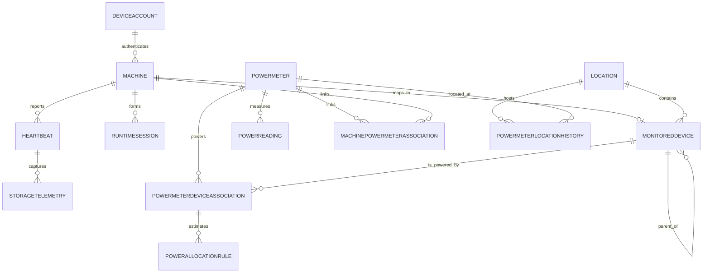

# Domain Model

## Modeling Intent

The data model separates telemetry producers, physical equipment, and contextual relationships. This is necessary because:

- A machine can exist without a power meter.
- A power meter can exist without a machine.
- A reporting machine can collect power data for equipment it does not power.
- One power meter can represent one device or many devices.

## Conventions

- Every entity below includes standard `CreatedAtUtc` and `UpdatedAtUtc` audit columns by default, in addition to the attributes listed. They are omitted from each entity's attribute list purely for brevity and are not optional.
- `Id` columns are assumed to be database-generated (for example, `uniqueidentifier`/GUID) unless noted otherwise.
- Enumerated attributes list suggested values. Treat these as a starting point, not a closed set, until Phase 1 implementation confirms them.
- Authentication credentials themselves (ASP.NET Core Identity users, password hashes, roles, tokens) live in the framework-owned Identity schema (`AspNetUsers`, `AspNetRoles`, etc.) and are not modeled as domain entities here. `DeviceAccount` (below) is the domain-owned companion table that attaches ownership and API-key metadata to an Identity user without altering Identity's own schema — this is the standard pattern for extending ASP.NET Core Identity rather than heavily customizing `IdentityUser`. See [architecture-overview.md](./architecture-overview.md#authentication-and-authorization) for the authentication design.

## Core Entities

### Machine

Represents a computer known to the monitoring platform.

Suggested attributes:

- `MachineId`
- `AgentId`
- `DeviceAccountId`
- `MachineName`
- `OperatingSystem`
- `Architecture`
- `AgentVersion`
- `FirstSeenAtUtc`
- `LastSeenAtUtc`
- `RegistrationStatus`
- `IsActive`

Notes:

- `AgentId` should be unique when present. It is the durable identity written onto every heartbeat and reading, and is distinct from the account used to authenticate the connection.
- `DeviceAccountId` is nullable and references the `DeviceAccount` (see Access Control Entities, below) currently authorized to submit telemetry for this machine. It is not required to be unique: multiple machines may share one device account, or each machine may have its own dedicated account, per the owning user's preference. Rotating a device's credential means updating this reference or rotating/disabling the underlying `DeviceAccount` — it does not need a historical association table the way power-meter relationships do, since only the current authorized account matters for authentication.
- A machine may exist before the background service is installed, and before any `DeviceAccountId` is assigned.

### Heartbeat

Represents a single telemetry submission from a reporting machine.

Suggested attributes:

- `HeartbeatId`
- `MachineId`
- `SequenceNumber`
- `SentAtUtc`
- `ReceivedAtUtc`
- `AgentStartedAtUtc`
- `SystemBootTimeUtc`
- `CpuUsagePercent`
- `TotalMemoryBytes`
- `AvailableMemoryBytes`
- `PayloadVersion`

### RuntimeSession

Represents a reconstructed period of continuous machine activity.

Suggested attributes:

- `RuntimeSessionId`
- `MachineId`
- `StartedAtUtc`
- `LastHeartbeatAtUtc`
- `EndedAtUtc`
- `EndReason`
- `HeartbeatCount`
- `CalculatedUptimeSeconds`

Suggested `EndReason` values:

- `Running`
- `GracefulShutdown`
- `ServiceStopped`
- `SleepOrHibernate`
- `HeartbeatTimeout`
- `AgentRestart`
- `MachineReboot`
- `Unknown`

Key rule:

- Sessions are derived from heartbeat continuity and lifecycle signals, not directly written by agents as authoritative uptime records.

### StorageTelemetry

Represents storage metrics captured at heartbeat time.

Suggested attributes:

- `StorageTelemetryId`
- `HeartbeatId`
- `VolumeName`
- `FileSystem`
- `TotalBytes`
- `AvailableBytes`

### PowerMeter

Represents a physical power-measuring device such as a Shelly Plug US Gen4.

Suggested attributes:

- `PowerMeterId`
- `ExternalDeviceId`
- `Vendor`
- `Model`
- `Name`
- `MacAddress`
- `IpAddress`
- `FirmwareVersion`
- `ConnectionType`
- `AuthenticationReference`
- `RegistrationStatus`
- `FirstSeenAtUtc`
- `LastSeenAtUtc`
- `IsActive`

Suggested `ConnectionType` values:

- `AgentPolling`
- `Mqtt`
- `WebSocket`
- `Webhook`
- `ShellyCloud`

Key rules:

- Power meters are registered independently from machines.
- `AuthenticationReference` must point to a secret manager entry or encrypted secret store. Never persist a Shelly device password or API credential directly on this record. Note this is separate from API authentication: it is the credential an *agent* uses to poll the meter locally, not a credential for calling this API.
- Not modeled yet: when Phase 4 direct-ingestion support is added (a meter or its broker calling the API without an agent intermediary), it will need its own `DeviceAccountId` reference analogous to `Machine.DeviceAccountId`. Given constrained devices like the Shelly Plug US Gen4 may not support the JWT login/refresh flow, that `DeviceAccount` would typically be configured with `AllowedAuthenticationMethods = ApiKey`. Add the reference at that time rather than now.

### PowerReading

Represents a measured reading from a power meter.

Suggested attributes:

- `PowerReadingId`
- `PowerMeterId`
- `MessageId`
- `MeasuredAtUtc`
- `ReceivedAtUtc`
- `Voltage`
- `CurrentAmps`
- `ActivePowerWatts`
- `ApparentPowerVoltAmps`
- `PowerFactor`
- `FrequencyHz`
- `TotalEnergyWattHours`
- `ReturnedEnergyWattHours`
- `OutputIsOn`
- `DeviceTemperatureCelsius`
- `RawPayload`

Key rule:

- Measured power belongs to the power meter, not to each associated device.

### MonitoredDevice

Represents physical equipment that may consume power or provide inventory context.

Suggested attributes:

- `MonitoredDeviceId`
- `LocationId`
- `ParentMonitoredDeviceId`
- `MachineId`
- `DeviceType`
- `Name`
- `Description`
- `Manufacturer`
- `Model`
- `SerialNumber`
- `AssetTag`
- `IsPowerConsumer`
- `IsActive`

Suggested `DeviceType` values:

- `Computer`
- `Server`
- `Monitor`
- `PowerStrip`
- `NetworkSwitch`
- `Router`
- `Printer`
- `StorageDevice`
- `UPS`
- `Peripheral`
- `Appliance`
- `Other`

Key rule:

- A reporting machine should be able to map to a monitored-device record, but not every monitored device is a reporting machine.

### Location

Represents physical placement context.

Suggested attributes:

- `LocationId`
- `ParentLocationId`
- `Name`
- `LocationType`
- `Description`
- `TimeZone`
- `AddressLine1`
- `AddressLine2`
- `City`
- `State`
- `PostalCode`
- `CountryCode`
- `IsActive`

Suggested `LocationType` values:

- `Site`
- `Building`
- `Floor`
- `Room`
- `Office`
- `Desk`
- `Rack`
- `Lab`
- `Other`

## Access Control Entities

### DeviceAccount

Represents the credential and ownership record for a device (or group of devices) permitted to call the ingestion API. Wraps an ASP.NET Core Identity user with the domain metadata Identity itself doesn't carry. See [architecture-overview.md](./architecture-overview.md#authentication-and-authorization) for the surrounding authentication design.

Suggested attributes:

- `DeviceAccountId`
- `IdentityUserId` (references the ASP.NET Core Identity user this account logs in as)
- `OwnerUserId` (references the ASP.NET Core Identity user, in the `Owner` role, who created and manages this account)
- `Name` (operator-facing label, for example "Office Fleet Account" or "DEV-WORKSTATION-01")
- `AllowedAuthenticationMethods`
- `ApiKeyHash`
- `ApiKeyCreatedAtUtc`
- `ApiKeyLastUsedAtUtc`
- `ApiKeyRevokedAtUtc`
- `IsActive`

Suggested `AllowedAuthenticationMethods` values:

- `Jwt`
- `ApiKey`
- `Both`

Key rules:

- A `DeviceAccount` is created and owned by exactly one owner account; it never exists without an `OwnerUserId`.
- One `DeviceAccount` may back many `Machine` records (shared account) or exactly one (dedicated account) — both are valid, and the choice belongs to the owner, not the schema.
- `ApiKeyHash` stores a salted hash only. The plaintext API key is returned to the owner exactly once, at creation or rotation time, and is never persisted or logged in recoverable form.
- `ApiKeyHash`, `ApiKeyCreatedAtUtc`, and `ApiKeyRevokedAtUtc` are only populated when `AllowedAuthenticationMethods` includes `ApiKey`. A `Jwt`-only account has no API key material at all.
- A `DeviceAccount` authorizes into a fixed, telemetry-only scope regardless of which allowed method authenticated the request. It can never be granted owner/administrative scope.

## Association Entities

### MachinePowerMeterAssociation

Represents the operational relationship between a reporting machine and a power meter — that is, *who reports the reading*.

Suggested attributes:

- `MachinePowerMeterAssociationId`
- `MachineId`
- `PowerMeterId`
- `RelationshipType`
- `EffectiveFromUtc`
- `EffectiveToUtc`
- `IsPrimary`

Suggested `RelationshipType` values:

- `DedicatedLoad`
- `SharedLoad`
- `CollectorOnly`

Meaning:

- `DedicatedLoad`: The meter powers only the reporting machine.
- `SharedLoad`: The reporting machine is one of multiple devices powered by the meter.
- `CollectorOnly`: The machine reports meter data but is not powered by that meter.

### PowerMeterDeviceAssociation

Represents which monitored devices are physically powered through a meter — that is, *what consumes the power*.

`RelationshipType` (above) and `AssociationType` (below) are intentionally separate, similar-looking enumerations. They answer different questions and can disagree: a `CollectorOnly` machine can coexist with several `Shared` device associations on the same meter, because the reporting machine is not itself one of the powered devices. Keep both distinctions rather than collapsing them into one field.

Suggested attributes:

- `AssociationId`
- `PowerMeterId`
- `MonitoredDeviceId`
- `AssociationType`
- `EstimatedSharePercent`
- `EffectiveFromUtc`
- `EffectiveToUtc`
- `IsPrimary`
- `Notes`

Suggested `AssociationType` values:

- `Dedicated`
- `Shared`

### PowerMeterLocationHistory

Represents where a power meter was located during a period of time.

Suggested attributes:

- `PowerMeterLocationHistoryId`
- `PowerMeterId`
- `LocationId`
- `EffectiveFromUtc`
- `EffectiveToUtc`
- `Notes`

### PowerAllocationRule

Deferred to Phase 4 (see [implementation-plan.md](./implementation-plan.md)). Represents an optional, explicitly *estimated* per-device share of a shared meter's measured power. This entity is not required for Phase 1–3 and should not be scaffolded until aggregate reporting work begins.

Suggested attributes:

- `PowerAllocationRuleId`
- `AssociationId` (references `PowerMeterDeviceAssociation`)
- `AllocationMethod`
- `FixedWatts`
- `Percentage`
- `Priority`
- `EffectiveFromUtc`
- `EffectiveToUtc`

Suggested `AllocationMethod` values:

- `None`
- `Percentage`
- `FixedBaseline`
- `AgentActivityWeighted`
- `Manual`

Key rule:

- Any value produced through a `PowerAllocationRule` must be surfaced as an estimate and must never be reported as a directly measured reading.

## Relationship Diagram

`DeviceAccount.OwnerUserId` and `DeviceAccount.IdentityUserId` both reference ASP.NET Core Identity's framework-owned user schema, which is intentionally not diagrammed here as a domain entity.

## Registration Lifecycle

Suggested lifecycle states for machines and power meters:

- `Discovered`
- `PendingApproval`
- `Active`
- `Disabled`
- `Retired`

This supports staged onboarding without forcing full trust or configuration at first contact.

## Identity Strategy

### Machine Identity Priority

1. Persistent `AgentId`
2. Stable hardware identifier where safely available
3. Machine name plus organizational context

### Power-Meter Identity Priority

1. Vendor-specific external device ID
2. MAC address
3. Managed external identifier

Key rule:

- IP address is runtime connectivity data, not durable identity.

## Integrity Rules

- `Machine.AgentId` must be unique when populated.
- `PowerMeter.Vendor + PowerMeter.ExternalDeviceId` should be unique.
- `PowerMeter.MacAddress` should be unique when present.
- A machine should have at most one active primary machine-to-meter association.
- Effective-dated associations should not overlap for mutually exclusive primary relationships.
- `DeviceAccount.OwnerUserId` must reference an Identity user in the `Owner` role; `DeviceAccount.IdentityUserId` must not also be an `Owner`-role account (a single account should not simultaneously authenticate as both an owner and a device).
- `DeviceAccount.ApiKeyHash` must never be null when `AllowedAuthenticationMethods` is `ApiKey` or `Both`, and must always be a hash, never a plaintext value.
- Deleting or disabling a `DeviceAccount` must not delete the `Machine` records that reference it; `Machine.DeviceAccountId` should become null (or point at a replacement account) rather than cascade-deleting telemetry history.

## Reporting Rules

- Dedicated machine-to-meter relationships can be reported as directly measured machine power.
- Shared-load relationships must be labeled as shared aggregate measurements.
- Collector-only relationships must never be treated as machine power consumption.
- Device-level power allocation (`PowerAllocationRule`) is optional and must always be labeled as estimated.
