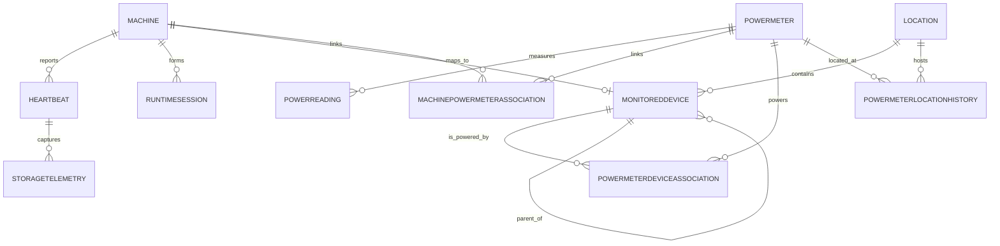

# Domain Model

## Modeling Intent

The data model separates telemetry producers, physical equipment, and contextual relationships. This is necessary because:

- A machine can exist without a power meter.
- A power meter can exist without a machine.
- A reporting machine can collect power data for equipment it does not power.
- One power meter can represent one device or many devices.

## Core Entities

## Machine

Represents a computer known to the monitoring platform.

Suggested attributes:

- `MachineId`
- `AgentId`
- `MachineName`
- `OperatingSystem`
- `Architecture`
- `AgentVersion`
- `FirstSeenAtUtc`
- `LastSeenAtUtc`
- `RegistrationStatus`
- `IsActive`

Notes:

- `AgentId` should be unique when present.
- A machine may exist before the background service is installed.

## Heartbeat

Represents a single telemetry submission from a reporting machine.

Suggested attributes:

- `HeartbeatId`
- `MachineId`
- `SequenceNumber`
- `SentAtUtc`
- `ReceivedAtUtc`
- `AgentStartedAtUtc`
- `SystemBootTimeUtc`
- `CpuUsagePercent`
- `TotalMemoryBytes`
- `AvailableMemoryBytes`
- `PayloadVersion`

## RuntimeSession

Represents a reconstructed period of continuous machine activity.

Suggested attributes:

- `RuntimeSessionId`
- `MachineId`
- `StartedAtUtc`
- `LastHeartbeatAtUtc`
- `EndedAtUtc`
- `EndReason`
- `HeartbeatCount`
- `CalculatedUptimeSeconds`

Key rule:

- Sessions are derived from heartbeat continuity and lifecycle signals, not directly written by agents as authoritative uptime records.

## StorageTelemetry

Represents storage metrics captured at heartbeat time.

Suggested attributes:

- `StorageTelemetryId`
- `HeartbeatId`
- `VolumeName`
- `FileSystem`
- `TotalBytes`
- `AvailableBytes`

## PowerMeter

Represents a physical power-measuring device such as a Shelly Plug US Gen4.

Suggested attributes:

- `PowerMeterId`
- `ExternalDeviceId`
- `Vendor`
- `Model`
- `Name`
- `MacAddress`
- `IpAddress`
- `FirmwareVersion`
- `ConnectionType`
- `RegistrationStatus`
- `FirstSeenAtUtc`
- `LastSeenAtUtc`
- `IsActive`

Key rule:

- Power meters are registered independently from machines.

## PowerReading

Represents a measured reading from a power meter.

Suggested attributes:

- `PowerReadingId`
- `PowerMeterId`
- `MessageId`
- `MeasuredAtUtc`
- `ReceivedAtUtc`
- `Voltage`
- `CurrentAmps`
- `ActivePowerWatts`
- `ApparentPowerVoltAmps`
- `PowerFactor`
- `FrequencyHz`
- `TotalEnergyWattHours`
- `ReturnedEnergyWattHours`
- `OutputIsOn`
- `DeviceTemperatureCelsius`
- `RawPayload`

Key rule:

- Measured power belongs to the power meter, not to each associated device.

## MonitoredDevice

Represents physical equipment that may consume power or provide inventory context.

Suggested attributes:

- `MonitoredDeviceId`
- `LocationId`
- `ParentMonitoredDeviceId`
- `MachineId`
- `DeviceType`
- `Name`
- `Description`
- `Manufacturer`
- `Model`
- `SerialNumber`
- `AssetTag`
- `IsPowerConsumer`
- `IsActive`

Key rule:

- A reporting machine should be able to map to a monitored-device record, but not every monitored device is a reporting machine.

## Location

Represents physical placement context.

Suggested attributes:

- `LocationId`
- `ParentLocationId`
- `Name`
- `LocationType`
- `Description`
- `TimeZone`
- `AddressLine1`
- `AddressLine2`
- `City`
- `State`
- `PostalCode`
- `CountryCode`
- `IsActive`

## Association Entities

## MachinePowerMeterAssociation

Represents the operational relationship between a reporting machine and a power meter.

Suggested attributes:

- `MachinePowerMeterAssociationId`
- `MachineId`
- `PowerMeterId`
- `RelationshipType`
- `EffectiveFromUtc`
- `EffectiveToUtc`
- `IsPrimary`

Suggested `RelationshipType` values:

- `DedicatedLoad`
- `SharedLoad`
- `CollectorOnly`

Meaning:

- `DedicatedLoad`: The meter powers only the reporting machine.
- `SharedLoad`: The reporting machine is one of multiple devices powered by the meter.
- `CollectorOnly`: The machine reports meter data but is not powered by that meter.

## PowerMeterDeviceAssociation

Represents which monitored devices are physically powered through a meter.

Suggested attributes:

- `AssociationId`
- `PowerMeterId`
- `MonitoredDeviceId`
- `AssociationType`
- `EstimatedSharePercent`
- `EffectiveFromUtc`
- `EffectiveToUtc`
- `IsPrimary`
- `Notes`

Suggested `AssociationType` values:

- `Dedicated`
- `Shared`

## PowerMeterLocationHistory

Represents where a power meter was located during a period of time.

Suggested attributes:

- `PowerMeterLocationHistoryId`
- `PowerMeterId`
- `LocationId`
- `EffectiveFromUtc`
- `EffectiveToUtc`
- `Notes`

## Relationship Diagram

## Registration Lifecycle

Suggested lifecycle states for machines and power meters:

- `Discovered`
- `PendingApproval`
- `Active`
- `Disabled`
- `Retired`

This supports staged onboarding without forcing full trust or configuration at first contact.

## Identity Strategy

## Machine Identity Priority

1. Persistent `AgentId`
2. Stable hardware identifier where safely available
3. Machine name plus organizational context

## Power-Meter Identity Priority

1. Vendor-specific external device ID
2. MAC address
3. Managed external identifier

Key rule:

- IP address is runtime connectivity data, not durable identity.

## Integrity Rules

- `Machine.AgentId` must be unique when populated.
- `PowerMeter.Vendor + PowerMeter.ExternalDeviceId` should be unique.
- `PowerMeter.MacAddress` should be unique when present.
- A machine should have at most one active primary machine-to-meter association.
- Effective-dated associations should not overlap for mutually exclusive primary relationships.

## Reporting Rules

- Dedicated machine-to-meter relationships can be reported as directly measured machine power.
- Shared-load relationships must be labeled as shared aggregate measurements.
- Collector-only relationships must never be treated as machine power consumption.
- Device-level power allocation is optional and should be marked as estimated if introduced.
